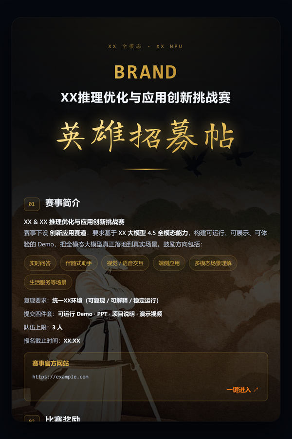

# AI赛事英雄帖生成器 · Recruit Poster

> 暗金武侠风「AI赛事英雄帖」一键生成 Skill。三种形态：**对话式（详细）生成**（你口述，我出图）、**填表式（快速）**（浏览器自助填表），支持 **三套模版**（1.0 竖卡 / 2.0 竖卡 / 3.0 长图）一份数据共用。

## 成品预览

### 模版 1.0 · 竖卡 2:3（v1 单人剪影）

> 固定比例 2:3，移动端友好。背景：v1 单人剪影。

---

### 模版 2.0 · 竖卡 2:3（v2 五人剪影+满月）⭐ 默认

> 固定比例 2:3，移动端友好。背景：v2 五人剪影+满月（当前主力模版）。

---

### 模版 3.0 · 长图（高度自适应）

> 高度自适应，内容流式排布。适合微信公众号/长图分享。背景：v2 五人剪影+满月。

> 三图均为脱敏预览（姓名/微信号已替换为 `XXX`），原定稿仍在本地只读保护区。
> 点击图片可查看原始高清大图。

---

## 快速开始

1. 触发词：「招募帖 / 英雄帖 / recruit poster」。
2. 选 **形态 A 对话式**（推荐）——AI 以武侠人设逐题发问（一轮一题），十问集齐自动生成。
3. 得到 `招募帖.html`，浏览器直接打开即见海报。
4. 换模版：重新跑 `node assets/build.mjs 招募帖-data.json 招募帖.html --template 1.0|2.0|3.0`（默认 2.0）。

> `build.mjs` 生成时自动把当前模版依赖（背景图 + 字体）拷贝到输出 HTML 同级 `design-assets/`，换任何工作区都能开箱即用。

## 两种形态

- **形态 A · 对话式（详细）生成**：口述赛事信息 → AI 生成 HTML 交付，最省事。
- **形态 B · 填表式（快速）**：复制 `assets/recruit-poster-builder.html` 到工作区打开预览，浏览器自助填表、实时预览、点「导出 HTML」下载。

## 三套模版

一份数据（`招募帖-data.json`）**内容共用**，仅背景图与版式随模版切换：

| 模版 | 背景图 | 版式 |
|---|---|---|
| `1.0` | v1 单人剪影（PNG） | 固定 2:3 竖卡 |
| `2.0` | v2 五人剪影+满月（JPG） | 固定 2:3 竖卡（默认） |
| `3.0` | v2 五人剪影+满月（JPG 长图） | 长图（高度自适应） |

## 仓库结构（三个版本）

| 目录 | 版本 | 特点 | 适用 |
|---|---|---|---|
| [`1-通用完整版/`](1-通用完整版/) | v1.6.0 | 含 `assets/design-assets/`（woff2 字体 + hero PNG + v2 JPG + 长图 JPG），多模版 `build.mjs` | GitHub / Gitee / 自托管等任意平台 |
| [`2-WORKBUDDY专用-极简版/`](2-WORKBUDDY专用-极简版/) | v1.4.0-workbuddy | 字体 + PNG 全部 base64 内嵌，**零二进制文件** | WorkBuddy / SkillHub 等禁二进制的平台 |
| [`3-定稿模板示例/`](3-定稿模板示例/) | 视觉基准 | 定稿成品（竖卡 2:3 + 长图版）脱敏示例，展示 Skill 产出效果 | 查看成品效果 |

## 约束与边界

- **背景锁定**：hero 位置 / 调色 / 蒙层 / 字体 / 配色在各模版内已定，Skill 只改 `.wrap` 内文字。
- **仅产 HTML**：默认不自动渲染 JPG（如需 JPG 用 `assets/render.mjs` 备用渲染）。
- **完全本地**：不联网、不向任何外部端点发送数据、不上传用户内容。

## 更新日志

- **v1.6.0**：`build.mjs` 生成时自动拷贝当前模版依赖（背景图 + 字体）到输出 HTML 同级 `design-assets/`，消除跨工作区缺图。
- **v1.5.0**：多模版系统——`--template 1.0/2.0/3.0`，一份数据内容全模版共用，仅背景与版式切换。
- **v1.4.0**：中文名定为「AI赛事英雄帖生成器」；WorkBuddy 极简版把字体+背景图全部 base64 内嵌（零二进制，可通过禁二进制平台）。
- **v1.3.0**：边界收敛，移除 JPG 产出线，Skill 仅产出 HTML。
- **v1.2.0**：新增英文十问剧本。
- **v1.1.0**：秦叔宝质检后修复（allowed-tools 审计说明、触发词扩至 13 条、输入校验）。
- **v1.0.0**：初版，对话式 + 填表器双形态。

## 作者

firecangshu（杨博）